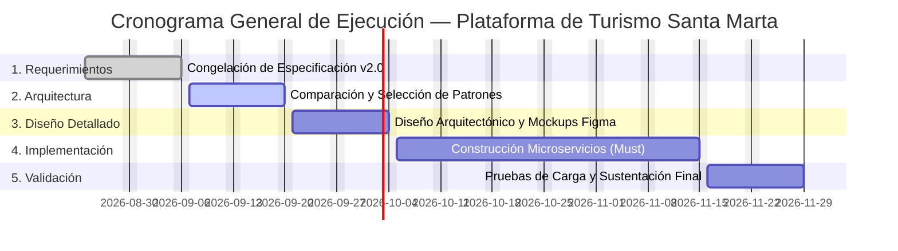

# Plan de Desarrollo de Software y Gestión del Proyecto

**Proyecto:** Plataforma Digital para la Gestión Integrada y Sostenible del Turismo en Santa Marta  
**Curso:** Arquitectura de Software — Experiencia Final de Diseño  
**Programa:** Ingeniería de Sistemas — Universidad del Magdalena  
**Versión:** 1.0  
**Fecha:** Agosto 2026  

---

## 1. Condiciones Generales del Proyecto

* **Equipo de Trabajo:** 5 ingenieros en formación con roles distribuidos:
  * Líder de Arquitectura / Módulo 1 (IAM & Seguridad).
  * Desarrollador Backend / Módulo 2 (Catálogo & GIS).
  * Desarrollador Backend / Módulo 3 (Reservas & Broker).
  * Desarrollador Fullstack / Módulo 4 (Reseñas & Frontend Web).
  * Especialista en Inteligencia Artificial / Módulo 5 & 6 (IA, Analítica & Gobernanza).
* **Horizonte Temporal:** 14 semanas lectivas efectivas.
* **Paradigma & Estilo Arquitectónico:** Orientación a Objetos, Servicios RESTful, Arquitectura Hexagonal / Limpia en servicios individuales y Desacople Asíncrono Orientado a Eventos.
* **Tope Presupuestal Asignado:** **USD 20.000**.

---

## 2. Cronograma de Ejecución y Plan de Fases

### 2.1 Diagrama de Gantt (14 Semanas)

<b>Ver especificación de código Mermaid del cronograma</b>

### 2.2 Desglose de Fases y Entregables Principales

| Fase | Entregables Principales | Semanas | Fechas |
|---|---|---|---|
| **Fase 1: Requerimientos y Dominio** | Documento de Requerimientos consolidado (v2.0 / SRS ISO 29148). | Semanas 1–2 | 24 ago – 6 sep |
| **Fase 2: Comparación Arquitectónica** | Informe de Selección de Patrones y Estilos Arquitectónicos. | Semanas 3–4 | 7 sep – 20 sep |
| **Fase 3: Diseño Arquitectónico** | Especificación técnica de interfaces, modelo de datos y wireframes UI en Figma. | Semanas 5–6 | 21 sep – 4 oct |
| **Fase 4: Construcción del Prototipo** | Microservicios, API Gateway, Broker y Base de Datos desplegados en contenedores (**Meta: $\ge 60\%$ de casos de uso *Must have***). | Semanas 7–12 | 5 oct – 15 nov |
| **Fase 5: Validación y Cierre** | Pruebas de carga, verificación de calidad, informe final y sustentación técnica. | Semanas 13–14 | 16 nov – 29 nov |

---

## 3. Metodología de Desarrollo y Control de Calidad

* **Marco de Trabajo:** Scrum adaptado para entornos académicos e interdisciplinarios, con ceremonias estructuradas en **sprints de 2 semanas** y seguimiento semanal de compromisos y dependencias técnicas.
* **Plataforma de Gestión:** GitHub Projects (tablero Kanban integrado directamente al control de versiones, ramas y *pull requests* de los repositorios de cada microservicio).
* **Control de Calidad:** Revisiones de código por pares (*Code Reviews*), linters estáticos automatizados y pruebas unitarias antes de la integración continua en ramas principales.

---

## 4. Modelo de Negocio y Sostenibilidad Institucional

* **Financiación Pública y Enfoque Social:** La plataforma se concibe como un bien público digital financiado por la Entidad de Gestión del Destino (Alcaldía Distrital de Santa Marta / Secretaría de Turismo / INDETUR), orientada al fortalecimiento del sector y la protección del patrimonio natural y cultural.
* **Gratuidad Integral:** Acceso libre y gratuito tanto para turistas como para prestadores turísticos (hoteles, guías y restaurantes locales), eliminando comisiones e intermediaciones abusivas.
* **Exclusión de Pasarela de Pagos Interna:** Al operar bajo un modelo de "solicitud y confirmación de disponibilidad", no se procesan transferencias monetarias ni números de tarjetas bancarias dentro de la infraestructura, eliminando los costos de certificación PCI-DSS y minimizando vectores de ataque financiero.

---

## 5. Modelos Presupuestales y Asignación de Recursos

Para responder a la formulación económica del proyecto, se presentan **dos alternativas presupuestales exhaustivas**: el **Escenario A (Austeridad Académica / Prototipo Semestral)** y el **Escenario B (Despliegue Piloto Operativo a Escala Institucional — Uso Total de USD 20.000)**.

---

### 5.1 Escenario A: Prototipo Académico y Validación Semestral (Austeridad FOSS / Free-Tier)

* **Objetivo:** Demostración de viabilidad técnica y cumplimiento de requerimientos del curso con máxima eficiencia de costos.
* **Presupuesto Estimado:** **USD ≈ 6.900** (dejando una holgura intencional de USD 13.100).

| Rubro | Estimado (USD) | Justificación Técnica |
|---|---|---|
| **Infraestructura Cloud Básica** | **4.500** | Cómputo en contenedores (ECS/Fargate o VPS Linux dedicado), base de datos gestionada y almacenamiento de archivos temporales durante 6 meses, apoyado en créditos académicos (AWS Educate / GitHub Student Pack). |
| **Servicios de Terceros & Notificaciones** | **1.200** | Uso de OpenStreetMap (100% gratuito sin licencia comercial) y servicios de correo transaccional en capa gratuita/baja escala (AWS SES / Mailtrap). |
| **Herramientas de Desarrollo y Colaboración** | **300** | Planes educativos en GitHub, Figma y Postman; margen para plugins o librerías específicas. |
| **Fondo de Contingencia Técnica (15%)** | **900** | Reserva ante eventuales picos de consumo o ajuste de instancias en fase de pruebas. |
| **TOTAL ESCENARIO A** | **≈ 6.900** | Modelo austero de desarrollo académico. |

---

### 5.2 Escenario B: Despliegue Piloto a Escala Real / Producción Institucional (Uso Total: USD 20.000)

* **Objetivo:** Ejecutar la totalidad de los **USD 20.000** en un plan integral de **despliegue piloto operativo a 12 meses** administrado por la Entidad de Gestión del Destino (Secretaría de Turismo de Santa Marta), asegurando alta disponibilidad, ciberseguridad rigurosa, digitalización de prestadores locales y adopción comunitaria.

| Componente de Inversión | Asignación (USD) | Desglose y Justificación Detallada |
|---|---|---|
| **1. Infraestructura Cloud de Alta Disponibilidad & Redundancia (12 Meses)** | **7.200** | • **Clúster de Cómputo Kubernetes / Docker:** Nodos redundantes en 2 zonas de disponibilidad para microservicios (USD 3.600 / año). • **Clúster de Bases de Datos PostgreSQL Multi-AZ & MongoDB:** Réplicas de lectura y alta disponibilidad con backups automáticos diarios (USD 2.200 / año). • **Almacenamiento Distribuido (S3/Object Storage):** Repositorio cifrado para documentos de prestadores (RNT, RUT) y multimedia (USD 600 / año). • **Red de Entrega de Contenidos (CDN) y WAF:** Mitigación DDoS y aceleración de assets estáticos y tiles de mapas OSM (USD 800 / año). |
| **2. Ciberseguridad, Pentesting y Cumplimiento Normativo (Ley 1581)** | **3.200** | • **Auditoría Externa de Seguridad y Pentesting:** Evaluación ética de penetración bajo metodología OWASP Top 10 antes del lanzamiento público (USD 1.800). • **Consultoría Jurídica en Habeas Data & Registro SIC:** Validación de términos y condiciones, avisos de privacidad y registro formal de bases de datos ante la Superintendencia de Industria y Comercio (USD 1.400). |
| **3. Levantamiento de Datos, Fotografía y Cartografía SIG Local** | **3.600** | • **Trabajo de Campo y Georreferenciación:** Levantamiento de coordenadas exactas y rutas para 100+ atractivos y prestadores en Santa Marta, Taganga, Rodadero, Minca y zonas de amortiguación del Tayrona (USD 2.000). • **Producción de Activos Digitales Abiertos:** Fotografía profesional de alta resolución libre de derechos de autor para el catálogo público (USD 1.600). |
| **4. Programa de Alfabetización Digital e Inclusión de MiPyMEs Turísticas** | **3.200** | • **Talleres Presenciales de Capacitación:** 4 jornadas comunitarias dirigidas a pequeños hoteleros, guías de turismo y asociaciones de lancheros para el uso del panel de prestador (USD 2.000). • **Materiales Didácticos y Kits de Adopción:** Guías visuales impresas y audiovisuales de soporte para prestadores de bajos recursos tecnológicos (USD 1.200). |
| **5. Observabilidad, Dominios Institucionales y Reserva de Contingencia** | **2.800** | • **Infraestructura de Monitoreo 24/7:** Servidores dedicados para Prometheus/Grafana y gestión de alertas operacionales (USD 800). • **Dominios y Certificados SSL Extended Validation (EV):** Adquisición de dominio institucional `.gov.co` o `.org` y certificados SSL seguros (USD 400). • **Fondo de Reserva y Contingencia Operativa (8%):** Reserva técnica para contingencias en servidores o ajustes normativos imprevistos (USD 1.600). |
| **TOTAL ESCENARIO B** | **20.000** | **Ejecución completa del 100% del presupuesto asignado.** |
