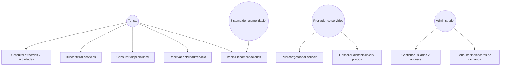

# Documento de Requerimientos Iniciales

**Proyecto:** Plataforma Digital para la Gestión Integrada y Sostenible del Turismo en Santa Marta

**Curso:** Arquitectura de Software — Experiencia Final de Diseño 

**Programa:** Ingeniería de Sistemas — Unimagdalena

**Versión:** 0.1 

**Fecha:** Agosto 2026

---

## 1. Contexto del Problema

Santa Marta es uno de los principales destinos turísticos del Caribe colombiano, y recibe anualmente un alto volumen de visitantes nacionales e internacionales atraídos por sus playas, el Centro Histórico, el Parque Nacional Natural Tayrona, la Sierra Nevada de Santa Marta y su oferta de turismo cultural, ecológico y de naturaleza.

Este crecimiento turístico representa una oportunidad de desarrollo económico y social, pero también genera retos relacionados con la gestión, integración y disponibilidad oportuna de información para la toma de decisiones de turistas, prestadores de servicios y actores responsables de la gestión del destino.

### 1.1 Problemáticas identificadas

- Concentración excesiva de turistas en ciertos atractivos y zonas durante temporadas de alta demanda.
- Baja integración entre la oferta de hoteles, restaurantes, operadores turísticos, actividades y atractivos.
- Poca visibilidad de pequeños y medianos prestadores de servicios turísticos.
- Información dispersa y heterogénea sobre disponibilidad, horarios, eventos y condiciones de los atractivos.
- Ausencia de mecanismos integrados de consulta y gestión de disponibilidad de servicios.
- Dificultad de los visitantes para seleccionar actividades según sus preferencias, restricciones y disponibilidad.
- Falta de indicadores para que entidades y operadores analicen el comportamiento de la demanda.
- Dificultad para mantener un servicio confiable durante períodos de alta concurrencia (picos de consulta, reserva y acceso).

### 1.2 Propuesta de solución

Se propone el diseño y desarrollo de un **prototipo funcional de una plataforma digital** para la gestión inteligente de información y servicios turísticos de Santa Marta. El núcleo del proyecto es la **arquitectura de software** capaz de integrar diversas fuentes de información y soportar los procesos de consulta, recomendación, disponibilidad y reserva de servicios turísticos, considerando escalabilidad, disponibilidad, interoperabilidad, seguridad, mantenibilidad, rendimiento y capacidad de evolución.

La inteligencia artificial **no es el objetivo principal**, sino un servicio complementario desacoplado del resto de la arquitectura sin embargo es un requisito funcional del proyecto a trabajar. Nuestro equipo busca desarrollar una forma de integrar la IA en el proyecto, (NO decidido) como ejemplo estan las siguientes:

- Recomendación personalizada de atractivos y actividades.
- Clasificación automática de opiniones/comentarios de visitantes.
- Predicción básica de ocupación o demanda.
- Chatbot turístico basado en información controlada.

---

## 2. Identificación de Stakeholders

| Stakeholder | Rol / Interés | Expectativas principales |
|---|---|---|
| Turistas / visitantes | Usuarios finales de la plataforma | Encontrar, comparar y reservar servicios turísticos de forma sencilla y confiable |
| Prestadores de servicios turísticos (hoteles, restaurantes, operadores) | Ofertan sus servicios en la plataforma | Visibilidad, gestión de disponibilidad, acceso equitativo (incluye pequeños operadores) |
| Entidades de gestión del destino (ej. secretarías de turismo, cámara de comercio) | Interesadas en indicadores y planificación | Reportes, indicadores de demanda, apoyo a decisiones de política turística |
| Administradores de la plataforma | Gestionan usuarios, contenido y seguridad | Herramientas de control de acceso, trazabilidad, moderación |

> *Nota: esta tabla es un punto de partida, analizar si es necesario agregar o quitar algun stakeholder.*

---

## 3. Diagramas de Casos de Uso

### 3.1 Actores identificados

- **Turista** (usuario no registrado / registrado)
- **Prestador de servicios turísticos**
- **Administrador de la plataforma**
- **Sistema de recomendación (IA)** (actor secundario / servicio)

### 3.2 Posibles casos de usos iniciales (Falta analizar la prioridad)

- Consultar atractivos, actividades y eventos.
- Buscar y filtrar servicios turísticos según preferencias.
- Consultar disponibilidad de un servicio/actividad.
- Reservar una actividad o servicio.
- Recibir recomendaciones personalizadas.
- Registrar/publicar un servicio (prestador).
- Gestionar disponibilidad y precios (prestador).
- Consultar indicadores de demanda (entidad de gestión / administrador).
- Gestionar usuarios y accesos (administrador).
- Consultar/clasificar opiniones de visitantes (según alternativa de IA elegida).
- Detallar la informacion de los diferentes sitios turisticos/restaurantes (comida, costo, habitaciones, promociones, etc.)
- El lenguaje de la aplicación debe ser tanto en ingles como español

### 3.3 Diagrama (borrador en notación Mermaid)

> *Nota: Diagrama generado por ia nuestra compañera Nieves trabaja con el diagrama de casos de usos, poner diagrama en este apartado.*

**Pendiente para el equipo:** construir el diagrama de casos de uso formal (UML) con relaciones `<<include>>` / `<<extend>>`, y priorizar cuáles son "arquitectónicamente significativos" (los que ejercitan más atributos de calidad).

---

## 4. Especificación de Requerimientos (base ISO/IEC/IEEE 29148:2018)

> Estructura preliminar. Debe completarse siguiendo el estándar ISO/IEC/IEEE 29148:2018 para especificación de requisitos (incluye trazabilidad, criterios de verificación y priorización).

### 4.1 Requerimientos funcionales (borrador)

| ID | Requerimiento | Prioridad |
|---|---|---|
| RF-01 | El sistema debe permitir consultar atractivos, actividades y eventos turísticos de Santa Marta. | Alta |
| RF-02 | El sistema debe permitir buscar y filtrar servicios turísticos por categoría, ubicación, precio y disponibilidad. | Alta |
| RF-03 | El sistema debe permitir consultar la disponibilidad de un servicio o actividad en tiempo (razonablemente) actualizado. | Alta |
| RF-04 | El sistema debe permitir a un turista reservar una actividad o servicio. | Alta |
| RF-05 | El sistema debe permitir a un prestador registrar y gestionar su oferta de servicios. | Alta |
| RF-06 | El sistema debe generar recomendaciones de atractivos/actividades según preferencias del visitante (funcionalidad de IA seleccionada). | Media |
| RF-07 | El sistema debe generar indicadores/reportes de demanda para apoyar la planificación turística. | Media |
| RF-08 | El sistema debe permitir la incorporación de pequeños y medianos prestadores con recursos tecnológicos limitados. | Media |
| RF-09 | El sistema debe gestionar usuarios, roles y control de acceso. | Alta |
| RF-10 | El sistema debe estar disponible en español e inglés. | Media |

### 4.2 Requerimientos no funcionales / atributos de calidad (borrador — ver sección 6 para escenarios medibles)

| ID | Atributo de calidad | Requerimiento |
|---|---|---|
| RNF-01 | Disponibilidad | El sistema debe tener una disponibilidad mínima del 99%. |
| RNF-02 | Escalabilidad | La arquitectura debe soportar picos de demanda en temporada alta sin degradación significativa del servicio. |
| RNF-03 | Interoperabilidad | El sistema debe integrar múltiples fuentes de información con distintas estructuras de datos. |
| RNF-04 | Seguridad | El sistema debe implementar autenticación, autorización y protección de datos personales (Ley 1581 de 2012). |
| RNF-05 | Mantenibilidad | La arquitectura debe permitir incorporar nuevos servicios/operadores sin modificaciones significativas al núcleo. |
| RNF-06 | Rendimiento | El sistema debe responder consultas dentro de tiempos aceptables incluso en alta concurrencia. |
| RNF-07 | Accesibilidad | Las interfaces deben ser accesibles para usuarios con distintos niveles de alfabetización digital y para personas con discapacidad. |
| RNF-08 | Transparencia (ético) | Las recomendaciones generadas por IA deben ser explicables al usuario. |

**Pendiente:** para cada requerimiento, agregar criterios de verificación, fuente, prioridad formal y trazabilidad hacia los objetivos y stakeholders (según ISO/IEC/IEEE 29148:2018).

---

## 5. Plan, Cronograma y Presupuesto (borrador inicial)

### 5.1 Condiciones generales del proyecto

- **Equipo:** 5 estudiantes, con roles asignados (Líder técnico/Arquitecto, Analista de requisitos, Diseñador de datos, Desarrollador principal, Responsable de validación y calidad).
- **Duración máxima:** 6 meses.
- **Presupuesto:** Máximo USD 20.000 para infraestructura del proyecto.
- **Paradigma:** Orientado a objetos.
- **Metodología:** Por definir y justificar por el equipo.

### 5.2 Cronograma preliminar (a ajustar por el equipo)

| Fase | Entregable | Duración estimada |
|---|---|---|
| 1. Requisitos y contexto | Documento de Requerimientos (este documento, completo) | Mes 1 |
| 2. Comparación de arquitecturas | Documento de Comparación y Selección de Arquitectura | Mes 2 |
| 3. Diseño arquitectónico | Documento de Diseño Arquitectónico Final | Mes 3 |
| 4. Implementación del prototipo | Código + despliegue (mínimo 60% de casos de uso priorizados) | Meses 4–5 |
| 5. Validación y cierre | Documento Final + evidencia de validación + sustentación | Mes 6 |

> Fechas para analizar, no son realistas con el semestre academico, adicional la documentación debe estar lista a mas tardar el 1 mes, los demas meses de trabajo se deberia enfocar en la implementacion del prototipo funcional.

### 5.3 Presupuesto preliminar (categorías a estimar)

- Infraestructura cloud (cómputo, almacenamiento, base(s) de datos).
- Servicios de terceros (mapas, notificaciones, si aplica).
- Herramientas de desarrollo/colaboración (mayormente software libre).
- Contingencia.

> **Pendiente:** cuantificar cada rubro y justificar frente al tope de USD 20.000.

---

## 6. Atributos de Calidad como Escenarios Medibles (borrador)

Formato sugerido: Fuente → Estímulo → Ambiente → Artefacto → Respuesta → Medida de respuesta.

| ID | Atributo | Escenario |
|---|---|---|
| ESC-01 | Disponibilidad | Ante una falla de un componente, el sistema debe seguir operativo, garantizando una disponibilidad ≥ 99% medida mensualmente. |
| ESC-02 | Escalabilidad / Rendimiento | Durante temporada alta, ante un incremento súbito de solicitudes concurrentes, el sistema debe mantener tiempos de respuesta aceptables (umbral por definir, ej. < X segundos en el 95% de las solicitudes). |
| ESC-03 | Interoperabilidad | Al incorporar una nueva fuente de información de un prestador, el sistema debe integrarla sin requerir cambios estructurales al núcleo de la plataforma. |
| ESC-04 | Seguridad | Ante un intento de acceso no autorizado a datos personales, el sistema debe rechazarlo y registrar el evento (trazabilidad). |
| ESC-05 | Mantenibilidad | Al incorporar un nuevo tipo de servicio turístico, el equipo de desarrollo debe poder hacerlo en un tiempo acotado (ej. < N días-persona) sin afectar otros componentes. |

> **Pendiente:** el equipo debe definir umbrales cuantitativos concretos y validarlos posteriormente contra el prototipo.

---

## 7. Análisis de Restricciones

### 7.1 Técnicas
- Acceso desde dispositivos móviles y Web.
- Integración con múltiples fuentes de información.
- Alta concurrencia en temporadas turísticas.
- Disponibilidad mínima del 99%.
- Arquitectura preparada para crecimiento progresivo.
- Evaluar persistencia única vs. políglota, justificando la decisión.
- Definir y justificar el estilo/tecnología de comunicación entre componentes.

### 7.2 Económicas y temporales
- Presupuesto piloto máximo: USD 20.000.
- Preferencia por software libre y servicios cloud de bajo costo.
- Equipo de 5 estudiantes.
- Plazo máximo: Fin de semestre.

### 7.3 Sociales
- Interfaces accesibles para distintos niveles de alfabetización digital.
- Disponibilidad en español e inglés.
- Inclusión de pequeños operadores con recursos tecnológicos limitados.

### 7.4 Ambientales
- Recomendación de destinos alternativos para reducir congestión.
- Reducción del impacto sobre ecosistemas sensibles.
- Difusión de buenas prácticas ambientales.
- Monitoreo de capacidad de carga turística.

### 7.5 Normativas
- Protección de datos personales — Ley 1581 de 2012.
- Protección de información comercial de los operadores.
- Gestión segura de autenticación y autorización.

### 7.6 Éticas
- Explicabilidad de las recomendaciones generadas por IA.
- Evitar sesgos sistemáticos hacia un operador específico.
- Protección de la privacidad de los turistas.
- Transparencia en el tratamiento de los datos.

---

