# Documento de Especificación de Requerimientos de Software

**Proyecto:** Plataforma Digital para la Gestión Integrada y Sostenible del Turismo en Santa Marta  
**Curso:** Arquitectura de Software — Experiencia Final de Diseño  
**Programa:** Ingeniería de Sistemas — Universidad del Magdalena  
**Versión:** 2.0 (Reorganizada y Consolidada — FOSS & Dual-Budget Architecture)  
**Fecha:** Agosto 2026  

---

## 1. Contexto del Problema

Santa Marta es uno de los principales destinos turísticos del Caribe colombiano, recibiendo anualmente un alto volumen de visitantes nacionales e internacionales atraídos por sus playas, el Centro Histórico, el Parque Nacional Natural Tayrona, la Sierra Nevada de Santa Marta y su diversa oferta de turismo cultural, gastronómico, ecológico y de aventura.

Este dinamismo turístico representa un motor esencial para el desarrollo socioeconómico regional, pero también introduce desafíos críticos relacionados con la gobernanza, integración de servicios, sostenibilidad ambiental y disponibilidad oportuna de información para la toma de decisiones informadas por parte de turistas, prestadores de servicios y entidades gubernamentales.

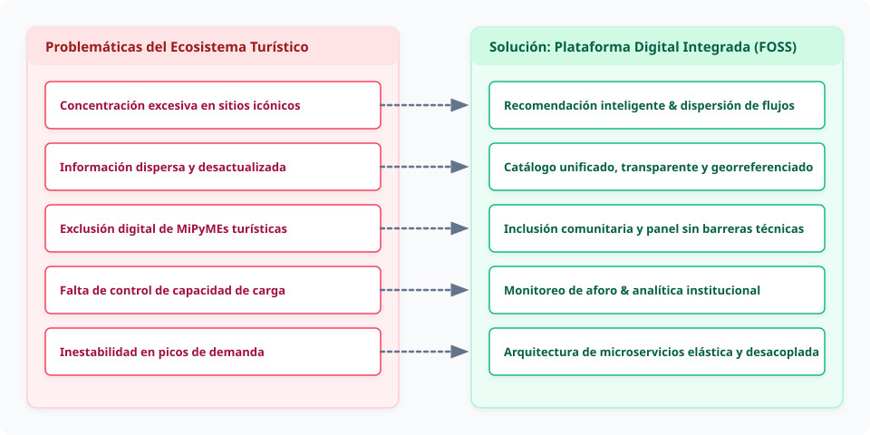

<b>Ver especificación de código Mermaid del diagrama</b>

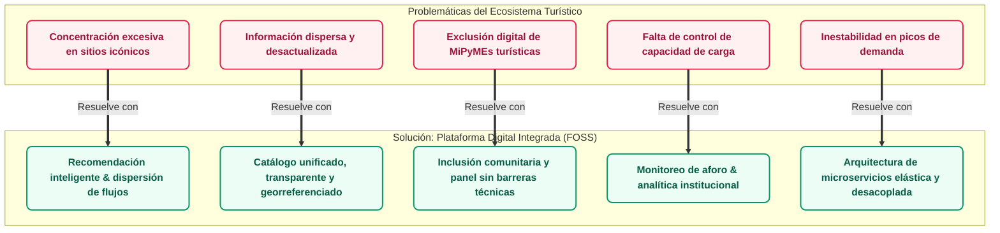

### 1.1 Problemáticas Identificadas

1. **Saturación y sobrecarga en zonas sensibles:** Concentración excesiva de turistas en atractivos tradicionales durante temporadas altas, impactando negativamente ecosistemas frágiles (ej. Parque Tayrona, Minca).
2. **Fragmentación y heterogeneidad de la oferta:** Baja integración entre hoteles, restaurantes, operadores y guías, con datos dispersos sobre disponibilidad, horarios, tarifas y normativas.
3. **Brecha digital y visibilidad inequitativa:** Limitada presencia tecnológica de micro, pequeños y medianos prestadores turísticos frente a grandes cadenas.
4. **Ausencia de gestión integrada de reservas y aforos:** Dificultad para consultar disponibilidad centralizada y gestionar solicitudes de reserva de forma anticipada.
5. **Déficit de inteligencia turística y datos para la toma de decisiones:** Carencia de indicadores consolidados de demanda, ocupación y capacidad de carga para la formulación de políticas públicas.
6. **Inestabilidad del servicio en picos de demanda:** Riesgo de degradación de sistemas digitales convencionales ante la concurrencia estacional masiva.

> [!NOTE]
> **Definición de Temporada Alta y Respaldo Cuantitativo:** Se contempla complementar la caracterización del problema con estadísticas oficiales del Sistema de Información Turística (SITUR Magdalena), Cotelco Magdalena y la Secretaría de Desarrollo Económico y Sostenibilidad de Santa Marta antes de la sustentación final.

### 1.2 Propuesta de Solución Arquitectónica

Se propone el diseño y desarrollo del prototipo funcional de una **Plataforma Digital para la Gestión Integrada y Sostenible del Turismo en Santa Marta**, fundamentada en una **arquitectura de microservicios basada 100% en Software Libre y de Código Abierto (FOSS)**.

El sistema garantiza atributos de calidad esenciales como escalabilidad elástica, alta disponibilidad, interoperabilidad abierta, seguridad integral (Ley 1581 de 2012) y mantenibilidad evolutiva.

* **Desacople del Servicio de Inteligencia Artificial (RF-06):** La IA actúa como un componente analítico auxiliar e independiente del núcleo transaccional. La inferencia de recomendaciones personalizadas opera de forma asíncrona mediante colas de mensajería (RabbitMQ / Redis Streams), impidiendo que el cómputo del modelo bloquee la experiencia del usuario.
* **Moderación Inteligente Embebida:** La clasificación y filtrado de reseñas no requiere un microservicio de IA pesado; se resuelve mediante una heurística liviana/modelo embebido en el módulo de reseñas para pre-marcar lenguaje ofensivo antes de la revisión humana.
* **Estrategia de Datos Sintéticos y Abiertos:** Debido a las restricciones de acceso a historiales privados de visitantes, el entrenamiento y validación del sistema de recomendación utilizará un dataset sintético estructurado por el equipo (perfiles de turista, matrices de interacción simuladas), enriquecido con datos geográficos de OpenStreetMap y estadísticas abiertas del portal nacional de Datos Abiertos de Colombia.

---

## 2. Identificación de Stakeholders

Conforme al estándar ISO/IEC/IEEE 29148:2018, los interesados del sistema se clasifican para delimitar el alcance, las responsabilidades operativas y la trazabilidad de requerimientos.

| Tipo | Stakeholder | Rol frente al Sistema | Intereses y Necesidades Principales |
|---|---|---|---|
| **Actor Directo** | **Turista** *(Nacional / Internacional)* | Usuario final que explora, consulta, solicita reservas y califica servicios turísticos. | • Información veraz, consolidada y en tiempo real. • Recomendaciones inteligentes y contextuales. • Proceso de solicitud de reserva ágil e intuitivo. • Interfaz bilingüe (Español/Inglés) y accesible. |
| **Actor Directo** | **Prestador Turístico** *(Hoteles, restaurantes, guías, operadores)* | Proveedor de información que publica ofertas, gestiona disponibilidad y atiende solicitudes. | • Canal de visibilidad digital gratuito y equitativo. • Administración simplificada de cupos y tarifas. • Protección de su información comercial. • Interacción directa con las reseñas de sus clientes. |
| **Actor Directo** | **Entidad de Gestión del Destino** *(Secretaría de Turismo, INDETUR, Corpoteyrona)* | Actor institucional responsable de la gobernanza, sostenibilidad y políticas turísticas. | • Acceso a analítica de demanda, tendencias y aforos. • Herramientas de alerta y comunicación oficial. • Reportes estructurados para toma de decisiones. |
| **Actor Directo** | **Administrador del Sistema** | Gestor técnico y operativo de la plataforma. | • Control de identidades, roles (RBAC) y permisos. • Verificación de legitimidad de prestadores. • Auditoría de seguridad y monitoreo de desempeño. |
| **Actor Indirecto / Normativo** | **Ente Regulador** *(Superintendencia de Industria y Comercio - SIC)* | Autoridad de supervisión de datos personales. | • Cumplimiento riguroso de la Ley Estatutaria 1581 de 2012 y Habeas Data. • Trazabilidad de consentimientos informados. |
| **Actor Indirecto / Externo** | **Servicios de Cartografía Abierta** *(OpenStreetMap / Nominatim)* | Proveedor de infraestructura geoespacial FOSS. | • Geolocalización, cálculo de distancias y visualización de capas de mapas sin costos de licenciamiento comercial. |
| **Actor Indirecto / Externo** | **Servicio de Notificaciones** *(SMTP / Postal / SES)* | Proveedor de entrega de correos transaccionales. | • Entrega confiable de correos de confirmación de reserva y avisos de seguridad. |

> [!IMPORTANT]
> **Restricción Normativa de Registro (Habeas Data):** El registro en la plataforma está formalmente restringido a personas **mayores de 18 años**. El tratamiento de datos de menores de edad queda fuera de alcance en esta iteración para simplificar el régimen legal aplicable.

---

## 3. Diagramas de Casos de Uso

### 3.1 Actores del Sistema

* **Turista (`Tur`):** Usuario final autenticado o anónimo que interactúa con el catálogo, solicita reservas y aporta reseñas.
* **Prestador de Servicios Turísticos (`Prest`):** Actor comercial verificado que administra servicios, cupos y atiende reservas.
* **Entidad de Gestión del Destino (`Entidad`):** Actor gubernamental o institucional que analiza métricas y emite avisos oficiales.
* **Administrador (`Admin`):** Custodio técnico de la seguridad, roles, moderación y observabilidad.
* **Sistema / Servicios Externos (`SysExt`):** Motor de colas, proveedor de mapas OSM y pasarela de correo SMTP.

### 3.2 Matriz Detallada de Casos de Uso

| Código | Caso de Uso | Actor Principal | Relaciones / Dependencias | Módulo Asignado |
|---|---|---|---|---|
| **UC1** | Registrarse en la plataforma (18+ años) | Turista, Prestador | `<<include>>` UC6 | Módulo 1: Seguridad & IAM |
| **UC2** | Iniciar sesión y obtener token de acceso | Todos los actores | Control de acceso perimetral | Módulo 1: Seguridad & IAM |
| **UC3** | Recuperar / restablecer contraseña | Turista, Prestador, Entidad | Verificación vía correo | Módulo 1: Seguridad & IAM |
| **UC4** | Gestionar perfil de usuario | Turista, Prestador | - | Módulo 1: Seguridad & IAM |
| **UC5** | Cambiar idioma de la interfaz (ES / EN) | Turista, Entidad | I18n transversal en frontend | Transversal (Frontend) |
| **UC6** | Aceptar política de tratamiento de datos personales | Sistema / Transversal | `<<include>>` en UC1 | Módulo 1: Seguridad & IAM |
| **UC7** | Consultar catálogo de atractivos, actividades y eventos | Turista (anónimo/autenticado) | Base de búsqueda | Módulo 2: Catálogo & GIS |
| **UC8** | Buscar y filtrar servicios (precio, zona, tipo) | Turista | `<<include>>` UC7 | Módulo 2: Catálogo & GIS |
| **UC9** | Consultar detalle de atractivo / servicio | Turista | `<<include>>` UC7 | Módulo 2: Catálogo & GIS |
| **UC10** | Consultar disponibilidad en tiempo real | Turista | `<<include>>` en UC11 | Módulo 3: Reservas & Cupos |
| **UC11** | Solicitar reserva de actividad o servicio | Turista | `<<include>>` UC2, `<<include>>` UC10 | Módulo 3: Reservas & Cupos |
| **UC12** | Cancelar / modificar solicitud de reserva | Turista | `<<include>>` UC13 | Módulo 3: Reservas & Cupos |
| **UC13** | Consultar historial de reservas propias | Turista | Extendido por UC14 | Módulo 3: Reservas & Cupos |
| **UC14** | Recibir recomendaciones personalizadas explicables | Turista | `<<extend>>` UC13, `<<async>>` | Módulo 5: IA & Recomendación |
| **UC15** | Calificar y redactar reseña de experiencia | Turista | Extendido por UC29 | Módulo 4: Anotaciones & Reseñas |
| **UC16** | Visualizar mapa interactivo de atractivos y zonas | Turista, Entidad | Integración OpenStreetMap | Módulo 2: Catálogo & GIS |
| **UC17** | Registrar nueva oferta turística | Prestador | `<<include>>` UC2, `<<include>>` UC28 | Módulo 2: Catálogo & GIS |
| **UC18** | Editar / actualizar información de servicio | Prestador | `<<include>>` UC2 | Módulo 2: Catálogo & GIS |
| **UC19** | Gestionar calendario de disponibilidad y tarifas | Prestador | `<<include>>` UC2 | Módulo 3: Reservas & Cupos |
| **UC20** | Confirmar / rechazar solicitudes de reserva | Prestador | Dispara evento a UC36 | Módulo 3: Reservas & Cupos |
| **UC21** | Responder públicamente a comentarios de turistas | Prestador | `<<include>>` UC15 | Módulo 4: Anotaciones & Reseñas |
| **UC22** | Consultar métricas de rendimiento de su oferta | Prestador | - | Módulo 6: Analítica & Destino |
| **UC23** | Consultar indicadores agregados de demanda turística | Entidad | `<<include>>` en UC25 | Módulo 6: Analítica & Destino |
| **UC24** | Monitorear estimación de capacidad de carga | Entidad | `<<include>>` en UC25 | Módulo 6: Analítica & Destino |
| **UC25** | Generar tableros de planificación turística | Entidad | `<<include>>` UC23, `<<include>>` UC24 | Módulo 6: Analítica & Destino |
| **UC26** | Publicar alertas oficiales y avisos de sostenibilidad | Entidad | - | Módulo 6: Analítica & Destino |
| **UC27** | Administrar usuarios, roles y asignación de permisos | Admin | Control RBAC central | Módulo 1: Seguridad & IAM |
| **UC28** | Aprobar / rechazar prestadores de servicios | Admin | `<<include>>` UC37 | Módulo 1: Seguridad & IAM |
| **UC29** | Moderar reseñas y contenido sensible reportado | Admin | `<<extend>>` UC15 | Módulo 4: Anotaciones & Reseñas |
| **UC30** | Configurar integraciones y orígenes de datos abiertos | Admin | - | Transversal (Config / GW) |
| **UC31** | Monitorear telemetría y métricas de salud del sistema | Admin | Prometheus + Grafana | Transversal (Observabilidad) |
| **UC32** | Gestionar políticas de seguridad y rate limiting | Admin | - | Módulo 1: Seguridad & IAM |
| **UC33** | Consultar bitácora de auditoría inmutable | Admin | Trazabilidad RNF-10 | Módulo 1: Seguridad & IAM |
| **UC36** | Despachar notificación de confirmación por correo | Sistema / SysExt | Disparado por UC20 | Módulo 6 / Worker Eventos |
| **UC37** | Cargar documentos de verificación (RNT, RUT) | Prestador | `<<include>>` en UC28 | Módulo 1: Seguridad & IAM |
| **UC38** | Exportar reportes analíticos (CSV / PDF) | Entidad | `<<extend>>` UC25 | Módulo 6: Analítica & Destino |

> [!NOTE]
> **Alcance Delimitado (Exclusiones Justificadas):**
> * **UC34 / UC35 (Pagos en línea):** Fuera de alcance. El prototipo opera bajo modelo de solicitud/confirmación de reserva; las transacciones monetarias se efectúan de manera directa e independiente entre turista y prestador.
> * **UC39 (Alertas de aforo automatizadas por sensores IoT):** Fuera de alcance debido a la ausencia de infraestructura de telemetría física en territorio; se cubre a nivel analítico estimativo mediante UC24.

### 3.3 Diagrama de Casos de Uso

**Visualización del Diagrama General:**

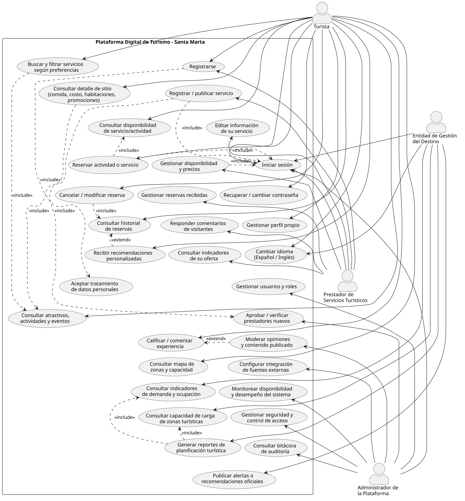

---

## 4. Decisiones de Arquitectura y Descomposición Modular

### 4.1 Estilo Arquitectónico Base y Descomposición Modular

Se adopta una **Arquitectura de Microservicios Desacoplada**, organizada en **6 microservicios funcionales bien delimitados (*Bounded Contexts*)**, un **API Gateway perimetral** y una **Capa Transversal de Mensajería y Observabilidad**, garantizando una separación nítida de responsabilidades y compatibilidad total con licenciamiento libre.

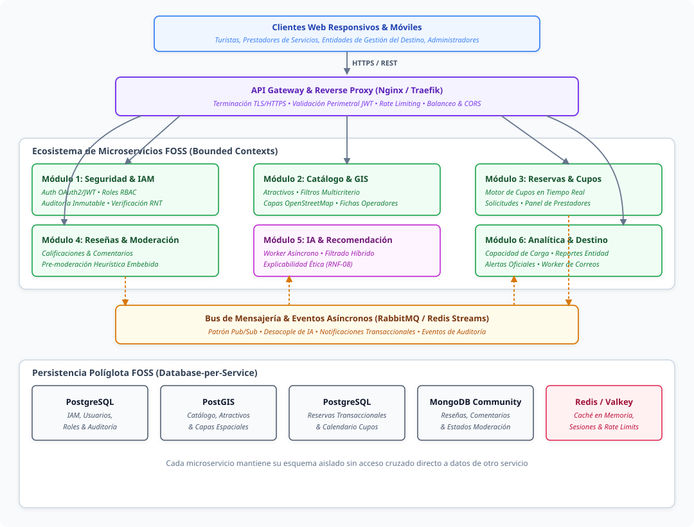

<b>Ver especificación de código Mermaid del diagrama de arquitectura</b>

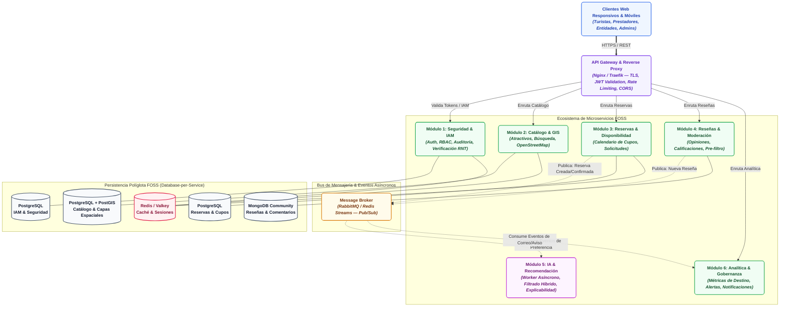

#### Detalle de Responsabilidades por Módulo

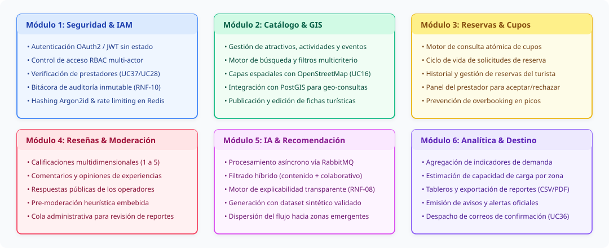

<b>Ver especificación de código Mermaid de responsabilidades por módulo</b>

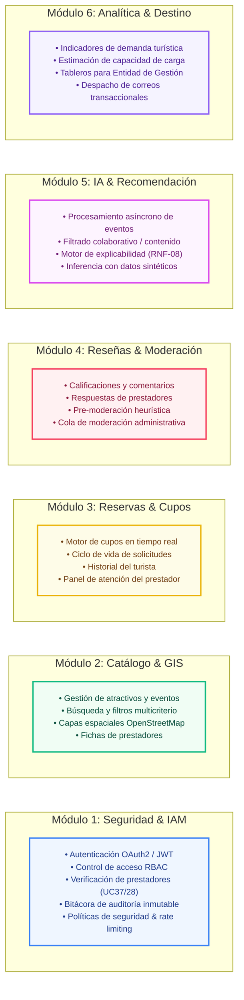

##### 1. Módulo 1: Autenticación, Seguridad y Gestión de Identidades (IAM Service)
* **Propósito:** Centralizar el control de acceso, la autenticación perimetral y la trazabilidad de seguridad del ecosistema.
* **Componentes y Funcionalidades:**
  * **Autenticación Robusta:** Emisión, firma y verificación de tokens sin estado JWT (JSON Web Tokens) bajo estándares OAuth2 / OpenID Connect.
  * **Autorización Basada en Roles (RBAC):** Control estricto de privilegios para los roles `Turista`, `Prestador`, `Entidad` y `Admin`.
  * **Seguridad Criptográfica:** Hashing de contraseñas mediante **Argon2id** (o Bcrypt con factor de costo elevado) y protección contra ataques de fuerza bruta.
  * **Verificación de Prestadores (UC28 / UC37):** Almacenamiento seguro y gestión del flujo de aprobación de documentos legales (Registro Nacional de Turismo - RNT, RUT).
  * **Bitácora Centralizada de Auditoría (UC33 / RNF-10):** Registro inmutable de eventos críticos (intentos de acceso fallidos, cambios de privilegios, aprobaciones de prestadores, exportaciones de datos).
  * **Políticas de Privacidad (UC6):** Registro auditable de la aceptación explícita de la política de tratamiento de datos personales (Ley 1581 de 2012).

##### 2. Módulo 2: Catálogo y Geolocalización Turística (Catalog & GIS Service)
* **Propósito:** Administrar la información estructurada de atractivos, actividades culturales/ecológicas, eventos y prestadores.
* **Componentes y Funcionalidades:**
  * **Motor de Búsqueda y Filtros:** Consultas indexadas por categoría, rango de precios, ubicación geográfica y etiquetas de sostenibilidad (UC7, UC8, UC9).
  * **Integración GIS Abierta:** Almacenamiento de coordenadas espaciales con **PostGIS** y renderizado de mapas interactivos vectoriales mediante **OpenStreetMap** y librerías cliente libres (**Leaflet.js** / **MapLibre GL**) (UC16).
  * **Publicación de Oferta:** Flujos de creación y actualización de fichas de servicios para prestadores habilitados (UC17, UC18).

##### 3. Módulo 3: Disponibilidad y Gestión de Reservas (Bookings & Availability Service)
* **Propósito:** Gestionar el ciclo de vida de las solicitudes de reserva y el control de cupos en tiempo real.
* **Componentes y Funcionalidades:**
  * **Control de Disponibilidad:** Consulta atómica y bloqueo temporal de cupos para evitar sobreventas (*overbooking*) (UC10, UC19).
  * **Máquina de Estados de Reserva:** Gestión de estados: `Solicitada` $\rightarrow$ `Confirmada` $\rightarrow$ `Rechazada` $\rightarrow$ `Cancelada` $\rightarrow$ `Finalizada` (UC11, UC12, UC20).
  * **Paneles de Control:** Vistas de historial para turistas (UC13) y consolas de gestión de solicitudes para prestadores (UC20).

##### 4. Módulo 4: Anotaciones, Reseñas y Moderación (Reviews & Community Service)
* **Propósito:** Fomentar la retroalimentación comunitaria garantizando un ambiente seguro y veraz.
* **Componentes y Funcionalidades:**
  * **Calificaciones y Reseñas:** Registro de puntuaciones multidimensionales (1 a 5 estrellas) y comentarios detallados (UC15).
  * **Interacción del Prestador:** Soporte para respuestas públicas y réplicas de prestadores sobre las opiniones de sus servicios (UC21).
  * **Pre-moderación Heurística Embebida:** Filtro algorítmico ligero basado en listas de palabras ofensivas y reglas semánticas para marcar automáticamente reseñas sospechosas antes de su publicación o enviarlas a la cola de moderación humana (UC29).

##### 5. Módulo 5: Inteligencia Artificial y Recomendación Desacoplada (AI Recommendation Service)
* **Propósito:** Generar sugerencias personalizadas de atractivos y actividades sin penalizar el rendimiento del núcleo transaccional.
* **Componentes y Funcionalidades:**
  * **Consumo Asíncrono de Eventos:** El servicio escucha eventos del bus de mensajería (interacciones del turista, búsquedas, reservas previas) para actualizar vectores de preferencia.
  * **Algoritmo de Filtrado Híbrido:** Combinación de filtrado basado en contenido (características de atractivos) y filtrado colaborativo simplificado alimentado por datos sintéticos.
  * **Módulo de Explicabilidad (RNF-08):** Cada recomendación genera metadatos de justificación comprensibles para el usuario (ej. *"Recomendado porque te interesan actividades al aire libre cerca de Minca"*).

##### 6. Módulo 6: Analítica y Gobernanza del Destino (Analytics & Destination Governance Service)
* **Propósito:** Proveer inteligencia de negocios turística a la Entidad de Gestión y gestionar comunicaciones transaccionales.
* **Componentes y Funcionalidades:**
  * **Monitoreo de Demanda y Capacidad de Carga:** Agregación estadística de solicitudes y visitas para calcular índices de presión turística por zona (UC23, UC24).
  * **Generación de Reportes:** Tableros de control y exportación estructurada de datos (CSV/PDF) para planificación territorial (UC25, UC38).
  * **Alertas Oficiales y Notificaciones:** Emisión de avisos institucionales (UC26) y despacho asíncrono de correos electrónicos transaccionales de confirmación de reserva (UC36).

##### 7. Capa Transversal: API Gateway, Observabilidad y Middleware
* **Propósito:** Proteger el perímetro, gestionar el enrutamiento y supervisar la salud operacional de la infraestructura.
* **Componentes y Funcionalidades:**
  * **API Gateway (Nginx / Traefik):** Enrutamiento inteligente, terminación TLS/HTTPS, validación perimetral de cabeceras JWT, limitación de tasa (*Rate Limiting*) y políticas de CORS.
  * **Observabilidad Centralizada:** Métricas en tiempo real con **Prometheus** y tableros de visualización con **Grafana**.

---

### 4.2 Estilo de Comunicación entre Componentes

Se implementa un **patrón híbrido** optimizado para balancear inmediatez y resiliencia:

1. **Comunicación Síncrona (REST / JSON sobre HTTPS):**
   * Empleada en operaciones donde el usuario requiere respuesta inmediata: autenticación, navegación del catálogo, consulta de disponibilidad y registro de reservas.
   * Documentada bajo el estándar OpenAPI 3.0.
2. **Comunicación Asíncrona Orientada a Eventos (Message Broker FOSS):**
   * Implementada con **RabbitMQ** (o Redis Streams) mediante el patrón Publicador/Suscriptor (*Pub/Sub*).
   * Desacopla tareas no críticas para el hilo principal: procesamiento del modelo de recomendación de IA, despacho de correos electrónicos de confirmación (UC36) y envío de eventos a la bitácora de auditoría (UC33).

---

### 4.3 Persistencia de Datos Políglota (100% FOSS)

Cada microservicio gestiona su propio almacén de datos (*Database-per-Service*), garantizando desacople y evitando bloqueos entre esquemas:

* **PostgreSQL + PostGIS (Relacional & Geoespacial):** Base de datos principal para el Módulo 1 (IAM/Seguridad), Módulo 2 (Catálogo con consultas espaciales) y Módulo 3 (Reservas transaccionales con consistencia ACID).
* **MongoDB Community Edition (Documental NoSQL):** Almacén para el Módulo 4 (Anotaciones y Reseñas), permitiendo estructuras flexibles, comentarios anidados, respuestas y banderas dinámicas de moderación.
* **Redis / Valkey (En memoria & Caché):** Almacenamiento temporal de sesiones, listas negras de tokens JWT, control de cuotas de peticiones (*Rate Limiting*) y aceleración de consultas de catálogo frecuente.

---

### 4.4 Stack Tecnológico y Coherencia con Software Libre (FOSS)

> [!NOTE]
> **Estado de Definición Tecnológica (Referencia Preliminar en Evaluación):**
> La selección de tecnologías, bases de datos y herramientas de desarrollo descritas en esta sección tiene un carácter **propositivo y referencial**, formulado para establecer una estructura lógica, coherencia de diseño y orden conceptual en este documento.
>
> **El stack tecnológico definitivo aún se encuentra en etapa de análisis y decisión por parte del equipo.** La selección final será evaluada formalmente durante la **Fase 2 (Comparación y Selección de Arquitectura)**, donde se sopesarán curvas de aprendizaje, compatibilidad, rendimiento y requerimientos específicos de implementación antes de congelar las herramientas definitivas.

La plataforma se concibe orientada íntegramente sobre tecnologías de código abierto (*Open Source*) con licencias permisivas (MIT, Apache 2.0, BSD, PostgreSQL, MPL 2.0), asegurando soberanía tecnológica, ausencia de costos de licenciamiento privativo y alta interoperabilidad.

| Capa Arquitectónica | Tecnología FOSS Propuesta (Referencial) | Licencia | Rol en la Solución |
|---|---|---|---|
| **API Gateway / Proxy** | **Nginx** o **Traefik** | BSD / MIT | Enrutamiento perimetral, SSL/TLS, Rate Limiting y CORS. |
| **Backend Core Services** | **Java OpenJDK / Spring Boot** o **TypeScript / NestJS** | GPLv2+CE / Apache 2.0 / MIT | Lógica de negocio de microservicios transaccionales. |
| **Backend IA Service** | **Python (FastAPI + Scikit-Learn + Pandas)** | BSD / PSF / Apache 2.0 | Microservicio asíncrono de recomendación explicable. |
| **Persistencia Relacional** | **PostgreSQL + PostGIS** | PostgreSQL License / GPL | Almacén transaccional y consultas geoespaciales. |
| **Persistencia NoSQL** | **MongoDB Community Edition** | SSPL / FOSS Compat. | Almacén semiestructurado de reseñas y comentarios. |
| **Caché & Sesiones** | **Redis** o **Valkey** | BSD-3-Clause | Caché de alta velocidad, rate limiting y sesiones. |
| **Message Broker** | **RabbitMQ** | MPL 2.0 | Bus de mensajería asíncrona para eventos desacoplados. |
| **Mapas & GIS** | **OpenStreetMap + Leaflet.js / MapLibre** | ODbL / BSD / MIT | Cartografía interactiva sin costo por consulta. |
| **Frontend Web** | **HTML5, CSS3 Vanilla, JavaScript / Vue.js** | MIT | Interfaz de usuario responsiva, accesible y bilingüe. |
| **Contenedores & Despliegue** | **Docker + Docker Compose** | Apache 2.0 | Estandarización de entornos de desarrollo y producción. |
| **Observabilidad** | **Prometheus + Grafana** | Apache 2.0 / AGPL | Telemetría, monitoreo de métricas y alertas del sistema. |
| **Seguridad / Criptografía** | **Librerías Argon2 / JWT (RFC 7519)** | Apache 2.0 / MIT | Cifrado de credenciales y tokens de acceso seguros. |

---

### 4.5 Modelo de Negocio y Sostenibilidad Institucional

* **Financiación Pública y Enfoque Social:** La plataforma se concibe como un bien público digital financiado por la Entidad de Gestión del Destino (Alcaldía Distrital de Santa Marta / Secretaría de Turismo / INDETUR), orientada al fortalecimiento del sector y la protección del patrimonio natural y cultural.
* **Gratuidad Integral:** Acceso libre y gratuito tanto para turistas como para prestadores turísticos (hoteles, guías y restaurantes locales), eliminando comisiones e intermediaciones abusivas.
* **Exclusión de Pasarela de Pagos Interna:** Al operar bajo un modelo de "solicitud y confirmación de disponibilidad", no se procesan transferencias monetarias ni números de tarjetas bancarias dentro de la infraestructura, eliminando los costos de certificación PCI-DSS y minimizando vectores de ataque financiero.

---

### 4.6 Metodología de Desarrollo y Gestión de Proyecto

* **Marco de Trabajo:** Scrum adaptado para entornos académicos e interdisciplinarios, con ceremonias estructuradas en **sprints de 2 semanas** y seguimiento semanal de compromisos.
* **Plataforma de Gestión:** GitHub Projects (Kanban integrado directamente al control de versiones, ramas y *pull requests* de los repositorios de cada microservicio).
* **Control de Calidad:** Revisiones de código por pares (*Code Reviews*), linters estáticos y pruebas unitarias automatizadas antes de la integración continua.

---

## 5. Especificación de Requerimientos (ISO/IEC/IEEE 29148:2018)

### 5.1 Requerimientos Funcionales (Priorización MoSCoW)

| ID | Requerimiento Funcional | Prioridad | Módulo Asignado | Stakeholder | Criterio de Verificación |
|---|---|---|---|---|---|
| **RF-01** | Consultar catálogo de atractivos, actividades y eventos turísticos. | **Must** | Módulo 2: Catálogo & GIS | Turista | Visualización completa del catálogo con filtros básicos sin requerir autenticación. |
| **RF-02** | Buscar y filtrar servicios por categoría, ubicación espacial, tarifa y disponibilidad. | **Must** | Módulo 2: Catálogo & GIS | Turista | Los filtros combinados devuelven resultados exactos en un tiempo inferior a 1.5s. |
| **RF-03** | Consultar la disponibilidad actualizada de cupos de un servicio. | **Must** | Módulo 3: Reservas & Cupos | Turista | El calendario refleja en tiempo real los cupos habilitados por el prestador. |
| **RF-04** | Registrar solicitudes de reserva de actividades o servicios turísticos. | **Must** | Módulo 3: Reservas & Cupos | Turista | Se genera una reserva en estado `Solicitada` visible en el panel del turista y del prestador. |
| **RF-05** | Permitir a los prestadores registrar y actualizar su oferta y cupos. | **Must** | Módulo 2 y 3 | Prestador | Un prestador verificado crea y edita servicios visualizándose inmediatamente en el catálogo. |
| **RF-06** | Generar recomendaciones personalizadas explicables mediante IA desacoplada. | **Should** | Módulo 5: IA & Recomendación | Turista | El usuario recibe sugerencias basadas en su historial/preferencias junto con la justificación explicativa (RNF-08). |
| **RF-07** | Generar tableros e indicadores agregados de demanda y aforo para planificación. | **Should** | Módulo 6: Analítica & Destino | Entidad | La entidad visualiza gráficos de demanda por zonas y estimación de concentración turística. |
| **RF-08** | Incorporación asistida y sin barreras técnicas para prestadores comunitarios. | **Should** | Módulo 1 y 2 | Prestador | El formulario de registro y carga de servicios no requiere más de 3 pasos sencillos. |
| **RF-09** | Gestión de identidades, control de acceso RBAC y bitácora de auditoría. | **Must** | Módulo 1: Seguridad & IAM | Admin | Intentos de acceso no autorizados devuelven HTTP 403 y quedan registrados en la bitácora. |
| **RF-10** | Disponibilidad de la interfaz en idiomas Español e Inglés (I18n). | **Should** | Transversal | Turista, Entidad | Conmutación instantánea de idioma traduciendo etiquetas, menús y contenidos base. |
| **RF-11** | Enviar notificaciones por correo de confirmación/cancelación de reservas. | **Should** | Módulo 6 / Broker | Turista, Prestador | Tras confirmarse la reserva (UC20), se despacha un correo formateado en menos de 10s. |
| **RF-12** | Permitir a prestadores adjuntar documentos de verificación legal (RNT, RUT). | **Should** | Módulo 1: Seguridad & IAM | Prestador, Admin | El prestador sube archivos PDF/imagen que son auditados por el administrador antes de publicar. |
| **RF-13** | Exportar reportes analíticos e indicadores en formatos estándar (CSV / PDF). | **Could** | Módulo 6: Analítica & Destino | Entidad | Descarga funcional de archivos estructurados con métricas del destino. |

---

### 5.2 Requerimientos No Funcionales y Atributos de Calidad

| ID | Atributo | Requerimiento No Funcional | Prioridad | Estándar / Verificación |
|---|---|---|---|---|
| **RNF-01** | **Disponibilidad** | El sistema debe mantener una tasa de disponibilidad operativa $\ge 99.0\%$ durante su ventana de servicio. | **Should** | Monitoreo continuo mediante sondas de salud (Healthchecks en `/health`). |
| **RNF-02** | **Escalabilidad** | La arquitectura de microservicios debe escalar horizontalmente ante incrementos de tráfico en temporada alta. | **Must** | Pruebas de carga simulada con herramientas FOSS (k6 / Locust / JMeter). |
| **RNF-03** | **Interoperabilidad** | La plataforma debe exponer APIs REST documentadas bajo especificación OpenAPI 3.0. | **Must** | Validación con esquemas Swagger/OpenAPI y consumo desacoplado. |
| **RNF-04** | **Seguridad** | Autenticación basada en JWT, cifrado de credenciales con Argon2id y cumplimiento de la Ley 1581 de 2012. | **Must** | Pruebas de vulnerabilidad estática y registro explícito de consentimiento (UC6). |
| **RNF-05** | **Mantenibilidad** | El desacople entre microservicios debe permitir modificar o reentrenar módulos sin alterar el núcleo. | **Should** | Tiempo estimado de incorporación de un nuevo servicio $\le 5$ días-persona. |
| **RNF-06** | **Rendimiento** | El tiempo de respuesta para el 95% de las consultas de catálogo debe ser inferior a 2.0 segundos. | **Must** | Medición de latencia percentil 95 ($p95$) bajo concurrencia controlada. |
| **RNF-07** | **Accesibilidad** | Las interfaces deben satisfacer pautas de diseño accesible (WCAG 2.1 Nivel AA básico: contraste, texto escalable). | **Should** | Evaluación con herramientas de auditoría accesible (Lighthouse / axe-core). |
| **RNF-08** | **Transparencia Ética** | Toda recomendación automática generada por el módulo de IA debe ser explicable y auditable. | **Should** | Cada recomendación incluye la entidad de justificación visible al turista. |
| **RNF-09** | **Respaldo & Recuperación** | Mecanismos de copia de seguridad periódica de las bases de datos y procedimiento de restauración validado. | **Should** | Ejecución de al menos un simulacro de restauración de datos documentado. |
| **RNF-10** | **Auditoría de Seguridad** | Registro inmutable de eventos administrativos, accesos denegados y modificaciones de estado. | **Must** | Consulta de bitácora disponible en panel administrativo (UC33). |
| **RNF-11** | **Usabilidad** | El flujo de solicitud de reserva debe completarse en un máximo de 4 pasos interactivos. | **Should** | Validación mediante pruebas de usuario guiadas (Buscar $\rightarrow$ Detalle $\rightarrow$ Solicitar $\rightarrow$ Confirmar). |
| **RNF-12** | **Portabilidad FOSS** | La solución debe ejecutarse en cualquier entorno Linux mediante contenedores Docker estándar. | **Must** | Despliegue reproducible con `docker-compose up` en servidores locales o cloud. |

---

## 6. Atributos de Calidad como Escenarios Medibles

Formato de especificación formal: **Fuente $\rightarrow$ Estímulo $\rightarrow$ Ambiente $\rightarrow$ Artefacto $\rightarrow$ Respuesta $\rightarrow$ Medida de Respuesta**.

| ID | Atributo | Escenario Formal |
|---|---|---|
| **ESC-01** | **Disponibilidad** | *Fuente:* Caída imprevista de un nodo de servicio. *Estímulo:* Falla en el contenedor del Módulo de Reseñas. *Ambiente:* Operación normal. *Artefacto:* API Gateway y clúster. *Respuesta:* El Gateway aísla el microservicio degradado sin interrumpir la navegación en catálogo ni las reservas. *Medida:* Disponibilidad global del sistema $\ge 99.0\%$, tiempo de aislamiento $< 5$ segundos. |
| **ESC-02** | **Rendimiento & Carga** | *Fuente:* Turistas concurrentes en temporada de vacaciones. *Estímulo:* 500 solicitudes concurrentes por segundo en búsqueda de catálogo. *Ambiente:* Pico estacional. *Artefacto:* Módulo 2 (Catálogo) + Caché Redis. *Respuesta:* El sistema atiende las consultas apoyándose en caché en memoria. *Medida:* Tiempo de respuesta $p95 < 2.0$ segundos sin errores HTTP 5xx. |
| **ESC-03** | **Interoperabilidad** | *Fuente:* Desarrollador / Administrador. *Estímulo:* Integración de una nueva fuente de datos abiertos de eventos culturales. *Ambiente:* Mantenimiento evolutivo. *Artefacto:* Módulo 2 (Catálogo). *Respuesta:* Ingesta de datos vía API REST sin modificar la estructura del esquema relacional base. *Medida:* Incorporación funcional completada en $\le 3$ días hábiles. |
| **ESC-04** | **Seguridad & Auditoría** | *Fuente:* Usuario no autorizado / Atacante externo. *Estímulo:* Intento de acceso a endpoints de reportes institucionales sin token o con rol inválido. *Ambiente:* Operación normal. *Artefacto:* Módulo 1 (IAM) y API Gateway. *Respuesta:* Bloqueo inmediato de la petición con HTTP 403 Forbidden y registro detallado del evento (IP, timestamp, usuario) en la bitácora. *Medida:* 100% de los accesos indebidos registrados en la bitácora de auditoría inmutable. |
| **ESC-05** | **Mantenibilidad** | *Fuente:* Equipo de ingeniería. *Estímulo:* Sustitución o ajuste del algoritmo de recomendación en el microservicio de IA. *Ambiente:* Ciclo de desarrollo. *Artefacto:* Módulo 5 (IA). *Respuesta:* Reentrenamiento y despliegue del nuevo worker de IA sin reiniciar ni alterar los microservicios de Reservas o Catálogo. *Medida:* Cero tiempo de inactividad (*zero-downtime*) en el núcleo transaccional. |
| **ESC-06** | **Recuperación ante Fallos** | *Fuente:* Administrador del sistema. *Estímulo:* Simulación de corrupción de la base de datos de reservas. *Ambiente:* Prueba de contingencia. *Artefacto:* Script de respaldo y PostgreSQL. *Respuesta:* Restauración del último volcado (*dump*) programado. *Medida:* Tiempo de recuperación objetivo ($RTO) \le 30$ minutos; pérdida máxima de datos ($RPO) \le 24$ horas. |
| **ESC-07** | **Usabilidad** | *Fuente:* Turista primerizo. *Estímulo:* Búsqueda, selección y envío de solicitud de reserva para un tour ecológico. *Ambiente:* Dispositivo móvil con conexión estándar 4G. *Artefacto:* Interfaz de usuario web. *Respuesta:* Navegación guiada en un flujo de 4 pantallas consecutivas sin bloqueos. *Medida:* Tasa de éxito en la tarea $\ge 90\%$ en pruebas de usabilidad asistidas. |

---

## 7. Plan, Cronograma y Modelos Presupuestales

### 7.1 Condiciones Generales del Proyecto

* **Equipo de Trabajo:** 5 ingenieros en formación con roles distribuidos (Líder de Arquitectura / IAM, Desarrollador Backend Catálogo & GIS, Desarrollador Backend Reservas & Broker, Desarrollador Fullstack Reseñas & Frontend, Especialista en IA & Analítica).
* **Horizonte Temporal:** 14 semanas lectivas efectivas.
* **Paradigma & Estilo:** Orientación a Objetos, Servicios RESTful, Arquitectura Hexagonal / Limpia en servicios individuales y Desacople por Eventos.
* **Tope Presupuestal Asignado:** **USD 20.000**.

### 7.2 Cronograma de Ejecución (14 Semanas)

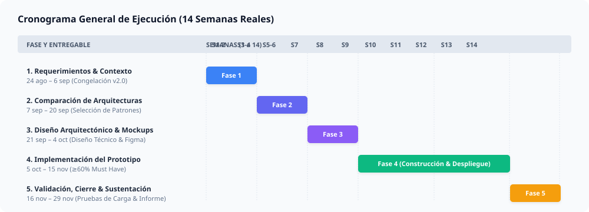

<b>Ver especificación de código Mermaid del cronograma</b>

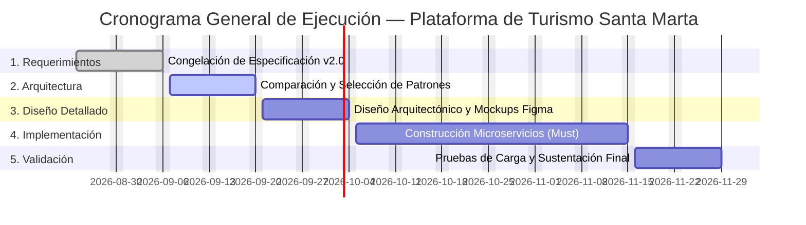

| Fase | Entregables Principales | Semanas | Fechas |
|---|---|---|---|
| **Fase 1: Requerimientos y Dominio** | Documento de Requerimientos consolidado (v2.0). | Semanas 1–2 | 24 ago – 6 sep |
| **Fase 2: Comparación Arquitectónica** | Informe de Selección de Patrones y Estilos Arquitectónicos. | Semanas 3–4 | 7 sep – 20 sep |
| **Fase 3: Diseño Arquitectónico** | Especificación técnica de interfaces, modelo de datos y wireframes UI en Figma. | Semanas 5–6 | 21 sep – 4 oct |
| **Fase 4: Construcción del Prototipo** | Microservicios, API Gateway, Broker y Base de Datos desplegados en contenedores (**Meta: $\ge 60\%$ de casos de uso *Must have***). | Semanas 7–12 | 5 oct – 15 nov |
| **Fase 5: Validación y Cierre** | Pruebas de carga, verificación de calidad, informe final y sustentación técnica. | Semanas 13–14 | 16 nov – 29 nov |

---

### 7.3 Modelos Presupuestales y Asignación de Recursos

Para responder a la formulación económica del proyecto, se presentan **dos alternativas presupuestales exhaustivas**: el **Escenario A (Austeridad Académica / Prototipo Semestral)** y el **Escenario B (Despliegue Piloto Operativo a Escala Institucional — Uso Total de USD 20.000)**.

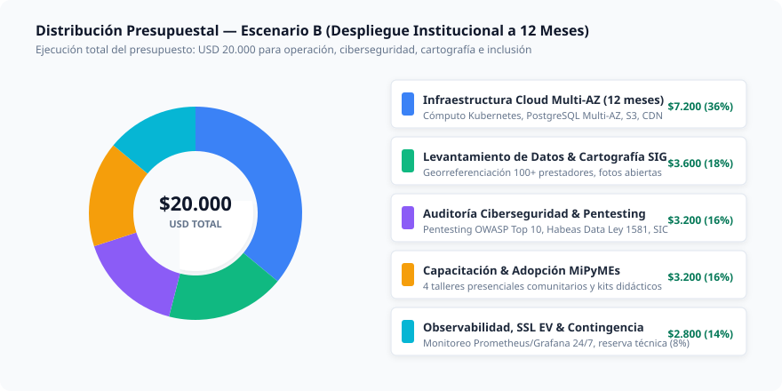

#### Escenario A: Prototipo Académico y Validación Semestral (Austeridad FOSS / Free-Tier)
* **Objetivo:** Demostración de viabilidad técnica y cumplimiento de requerimientos del curso con máxima eficiencia de costos.
* **Presupuesto Estimado:** **USD ≈ 6.900** (dejando una holgura intencional de USD 13.100).

| Rubro | Estimado (USD) | Justificación Técnica |
|---|---|---|
| **Infraestructura Cloud Básica** | **4.500** | Cómputo en contenedores (ECS/Fargate o VPS Linux dedicado), base de datos gestionada y almacenamiento de archivos temporales durante 6 meses, apoyado en créditos académicos (AWS Educate / GitHub Student Pack). |
| **Servicios de Terceros & Notificaciones** | **1.200** | Uso de OpenStreetMap (100% gratuito sin licencia comercial) y servicios de correo transaccional en capa gratuita/baja escala (AWS SES / Mailtrap). |
| **Herramientas de Desarrollo y Colaboración** | **300** | Planes educativos en GitHub, Figma y Postman; margen para plugins o librerías específicas. |
| **Fondo de Contingencia Técnica (15%)** | **900** | Reserva ante eventuales picos de consumo o ajuste de instancias en fase de pruebas. |
| **TOTAL ESCENARIO A** | **≈ 6.900** | Modelo austero de desarrollo académico. |

---

#### Escenario B: Despliegue Piloto a Escala Real / Producción Institucional (Uso Total: USD 20.000)
* **Objetivo:** Ejecutar la totalidad de los **USD 20.000** en un plan integral de **despliegue piloto operativo a 12 meses** administrado por la Entidad de Gestión del Destino (Secretaría de Turismo de Santa Marta), asegurando alta disponibilidad, ciberseguridad rigurosa, digitalización de prestadores locales y adopción comunitaria.

| Componente de Inversión | Asignación (USD) | Desglose y Justificación Detallada |
|---|---|---|
| **1. Infraestructura Cloud de Alta Disponibilidad & Redundancia (12 Meses)** | **7.200** | • **Clúster de Cómputo Kubernetes / Docker:** Nodos redundantes en 2 zonas de disponibilidad para microservicios (USD 3.600 / año). • **Clúster de Bases de Datos PostgreSQL Multi-AZ & MongoDB:** Réplicas de lectura y alta disponibilidad con backups automáticos diarios (USD 2.200 / año). • **Almacenamiento Distribuido (S3/Object Storage):** Repositorio cifrado para documentos de prestadores (RNT, RUT) y multimedia (USD 600 / año). • **Red de Entrega de Contenidos (CDN) y WAF:** Mitigación DDoS y aceleración de assets estáticos y tiles de mapas OSM (USD 800 / año). |
| **2. Ciberseguridad, Pentesting y Cumplimiento Normativo (Ley 1581)** | **3.200** | • **Auditoría Externa de Seguridad y Pentesting:** Evaluación ética de penetración bajo metodología OWASP Top 10 antes del lanzamiento público (USD 1.800). • **Consultoría Jurídica en Habeas Data & Registro SIC:** Validación de términos y condiciones, avisos de privacidad y registro formal de bases de datos ante la Superintendencia de Industria y Comercio (USD 1.400). |
| **3. Levantamiento de Datos, Fotografía y Cartografía SIG Local** | **3.600** | • **Trabajo de Campo y Georreferenciación:** Levantamiento de coordenadas exactas y rutas para 100+ atractivos y prestadores en Santa Marta, Taganga, Rodadero, Minca y zonas de amortiguación del Tayrona (USD 2.000). • **Producción de Activos Digitales Abiertos:** Fotografía profesional de alta resolución libre de derechos de autor para el catálogo público (USD 1.600). |
| **4. Programa de Alfabetización Digital e Inclusión de MiPyMEs Turísticas** | **3.200** | • **Talleres Presenciales de Capacitación:** 4 jornadas comunitarias dirigidas a pequeños hoteleros, guías de turismo y asociaciones de lancheros para el uso del panel de prestador (USD 2.000). • **Materiales Didácticos y Kits de Adopción:** Guías visuales impresas y audiovisuales de soporte para prestadores de bajos recursos tecnológicos (USD 1.200). |
| **5. Observabilidad, Dominios Institucionales y Reserva de Contingencia** | **2.800** | • **Infraestructura de Monitoreo 24/7:** Servidores dedicados para Prometheus/Grafana y gestión de alertas operacionales (USD 800). • **Dominios y Certificados SSL Extended Validation (EV):** Adquisición de dominio institucional `.gov.co` o `.org` y certificados SSL seguros (USD 400). • **Fondo de Reserva y Contingencia Operativa (8%):** Reserva técnica para contingencias en servidores o ajustes normativos imprevistos (USD 1.600). |
| **TOTAL ESCENARIO B** | **20.000** | **Ejecución completa del 100% del presupuesto asignado.** |

---

## 8. Análisis Integral de Restricciones

### 8.1 Restricciones Técnicas
* **Arquitectura de Microservicios:** Despliegue obligatorio de los 6 microservicios definidos en la Sección 4.1 mediante contenedores Docker.
* **Persistencia Políglota FOSS:** Uso exclusivo de PostgreSQL + PostGIS, MongoDB Community Edition y Redis / Valkey.
* **Integración Abierta:** Prohibición del uso de APIs privativas de mapas con costos por consumo (ej. Google Maps API); uso estricto del ecosistema OpenStreetMap.
* **Compatibilidad Multiplataforma:** Interfaz web responsiva compatible con navegadores móviles y de escritorio modernos sin requerir instalación de aplicativos nativos.

### 8.2 Restricciones Económicas y de Recursos
* **Techo Presupuestal:** Límite financiero estricto de **USD 20.000**, con esquemas de ejecución transparente para prototipo académico (USD 6.900) o despliegue institucional piloto (USD 20.000).
* **Talento Humano:** Proyecto ejecutado por un equipo de 5 ingenieros en un marco temporal de 14 semanas lectivas.
* **Modelo Gratuito:** Sin monetización directa ni comisiones sobre transacciones de reserva.

### 8.3 Restricciones Sociales y de Accesibilidad
* **Inclusión de la Economía Popular:** Interfaces intuitivas diseñadas para prestadores turísticos tradicionales con baja alfabetización digital (RF-08).
* **Internacionalización:** Soporte bilingüe completo (Español / Inglés) en catálogo y flujos transaccionales.
* **Límite de Edad:** Registro exclusivo para personas mayores de 18 años para resguardar la privacidad infantil.

### 8.4 Restricciones Ambientales y de Sostenibilidad
* **Protección de Ecosistemas Vulnerables:** Los algoritmos de recomendación deben priorizar la dispersión de flujos turísticos hacia destinos emergentes para mitigar la saturación de áreas protegidas de la Sierra Nevada y el Parque Tayrona.
* **Monitoreo de Capacidad de Carga:** Indicadores analíticos para apoyar las restricciones de ingreso dictadas por autoridades ambientales.

### 8.5 Restricciones Normativas y Legales
* **Ley 1581 de 2012 (Protección de Datos Personales):** Consentimiento informado previo, almacenamiento cifrado de datos sensibles y derecho de actualización/supresión (Habeas Data).
* **Ley General de Turismo (Ley 300 de 1996 / Ley 2068 de 2020):** Exigencia del Registro Nacional de Turismo (RNT) como requisito de verificación para prestadores comerciales.

### 8.6 Restricciones Éticas en Inteligencia Artificial
* **Explicabilidad Algorítmica (RNF-08):** Prohibición de modelos de caja negra impenetrables; toda sugerencia turística debe indicar su lógica de recomendación al usuario final.
* **Equidad y Neutralidad:** El algoritmo no debe aplicar sesgos discriminatorios ni favorecer comercialmente a ningún operador sobre otro.

---

## 9. Modelo de Datos Preliminar por Microservicio

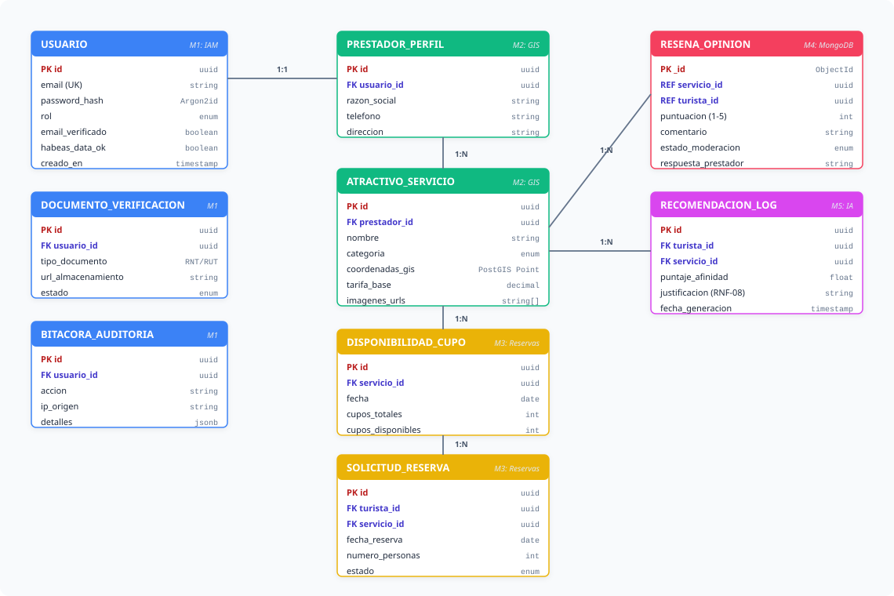

<b>Ver especificación de código Mermaid del modelo de datos</b>

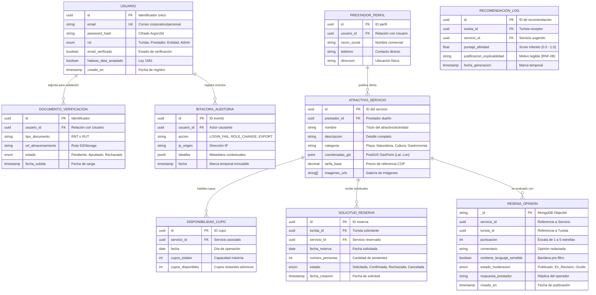

---

## 10. Matriz de Riesgos del Proyecto y Mitigación

| ID | Categoría | Descripción del Riesgo | Impacto | Probabilidad | Estrategia de Mitigación Propuesta |
|---|---|---|---|---|---|
| **R-01** | **Técnico** | Curva de aprendizaje del equipo en orquestación de microservicios y colas asíncronas. | Alto | Media | Iniciar el desarrollo local con Docker Compose unificado antes de realizar cualquier despliegue en nube; establecer plantillas base para los microservicios. |
| **R-02** | **Seguridad** | Exposición de endpoints o fuga de datos sensibles de prestadores y turistas. | Crítico | Baja | Aplicación de arquitectura Zero-Trust interna, validación perimetral de JWT en API Gateway, cifrado Argon2id y auditorías automatizadas de código. |
| **R-03** | **Alcance** | Desviación del alcance por complejización innecesaria del módulo de Inteligencia Artificial. | Alto | Media | Congelamiento estricto del alcance en RF-06 (recomendación basada en filtrado híbrido con datos sintéticos y explicabilidad básica), descartando chatbots o visión artificial. |
| **R-04** | **Datos** | Falta de datasets históricos reales de visitantes en Santa Marta. | Medio | Alta | Generación controlada de datasets sintéticos enriquecidos con capas geográficas abiertas de OpenStreetMap y estadísticas de SITUR/MinCIT. |
| **R-05** | **Gestión** | Disponibilidad heterogénea de tiempo entre integrantes del equipo durante el semestre. | Alto | Media | Sprints cortos de 2 semanas con entregables modulares e independientes asignados 1:1 por microservicio, visibilizados en GitHub Projects. |

---

## 11. Lineamientos de Mockups y Prototipado (Figma)

Para la **Fase 3 (Diseño Arquitectónico)**, se estructurarán prototipos interactivos de baja y media fidelidad en Figma cubriendo los flujos críticos del sistema:

1. **Flujo de Acceso y Consentimiento:** Pantalla de Registro con casilla obligatoria de Aceptación de Tratamiento de Datos (UC1/UC6) y Login bilingüe (UC2/UC5).
2. **Catálogo y Mapa Interactivo:** Vista de exploración con mapa OpenStreetMap integrado, capas de filtrado multicriterio y fichas resumidas (UC7, UC8, UC16).
3. **Ficha de Detalle y Disponibilidad:** Visualización de fotografías, tarifas, cupos en tiempo real y reseñas verificadas (UC9, UC10, UC15).
4. **Flujo Simplificado de Reserva:** Proceso guiado en 4 pasos (*Usabilidad RNF-11*): Selección de fecha/personas $\rightarrow$ Resumen de solicitud $\rightarrow$ Envío de reserva $\rightarrow$ Pantalla de confirmación y aviso de correo (UC11, UC36).
5. **Consola del Prestador:** Panel de control para registrar servicios (UC17), cargar documentos RNT (UC37), fijar cupos (UC19) y gestionar solicitudes de reserva entrantes (UC20).
6. **Tablero Institucional de la Entidad:** Panel analítico con indicadores de afluencia por sector, mapa de calor de demanda y herramientas de exportación (UC23, UC24, UC25, UC38).

---

## 12. Matriz de Trazabilidad Global

La trazabilidad integral de la plataforma vincula cada necesidad de los interesados con su materialización técnica en casos de uso, requerimientos, módulos de software y pruebas de calidad:

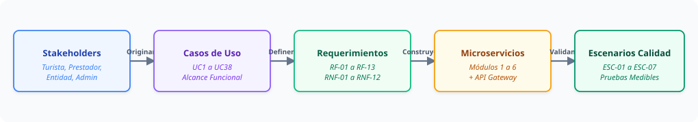

<b>Ver especificación de código Mermaid de trazabilidad</b>

```mermaid
flowchart LR
    classDef stStyle fill:#eff6ff,stroke:#3b82f6,stroke-width:2px,color:#1e40af,font-weight:bold,rx:8px,ry:8px;
    classDef ucStyle fill:#f5f3ff,stroke:#8b5cf6,stroke-width:2px,color:#5b21b6,font-weight:bold,rx:8px,ry:8px;
    classDef reqStyle fill:#f0fdf4,stroke:#10b981,stroke-width:2px,color:#065f46,font-weight:bold,rx:8px,ry:8px;
    classDef modStyle fill:#fffbeb,stroke:#f59e0b,stroke-width:2px,color:#92400e,font-weight:bold,rx:8px,ry:8px;
    classDef escStyle fill:#ecfdf5,stroke:#059669,stroke-width:2px,color:#064e3b,font-weight:bold,rx:8px,ry:8px;

    ST["Stakeholders<br><i>(Turista, Prestador, Entidad, Admin)</i>"]:::stStyle
    UC["Casos de Uso<br><i>(UC1 - UC38)</i>"]:::ucStyle
    RF["Requerimientos<br><i>(RF-01 a 13 / RNF-01 a 12)</i>"]:::reqStyle
    MOD["Microservicios FOSS<br><i>(Módulos 1 a 6 + Gateway)</i>"]:::modStyle
    ESC["Escenarios de Calidad<br><i>(ESC-01 a ESC-07)</i>"]:::escStyle

    ST ==>|Originan| UC
    UC ==>|Especifican| RF
    RF ==>|Se implementan en| MOD
    MOD ==>|Se validan con| ESC
```

| Módulo Arquitectónico | Casos de Uso Asignados | Requerimientos Funcionales | Requerimientos No Funcionales | Escenarios de Verificación |
|---|---|---|---|---|
| **Módulo 1: Seguridad & IAM** | UC1, UC2, UC3, UC4, UC6, UC27, UC28, UC32, UC33, UC37 | RF-08, RF-09, RF-12 | RNF-04, RNF-10 | ESC-04, ESC-06 |
| **Módulo 2: Catálogo & GIS** | UC7, UC8, UC9, UC16, UC17, UC18 | RF-01, RF-02, RF-05 | RNF-02, RNF-03, RNF-06 | ESC-02, ESC-03 |
| **Módulo 3: Reservas & Cupos** | UC10, UC11, UC12, UC13, UC19, UC20 | RF-03, RF-04, RF-05 | RNF-02, RNF-06, RNF-11 | ESC-02, ESC-07 |
| **Módulo 4: Reseñas & Moderación** | UC15, UC21, UC29 | RF-01, RF-05 | RNF-01, RNF-05 | ESC-01, ESC-05 |
| **Módulo 5: IA & Recomendación** | UC14 | RF-06 | RNF-05, RNF-08 | ESC-05 |
| **Módulo 6: Analítica & Destino** | UC22, UC23, UC24, UC25, UC26, UC36, UC38 | RF-07, RF-11, RF-13 | RNF-01, RNF-03 | ESC-01, ESC-03 |
| **API Gateway & Observabilidad** | UC2, UC5, UC30, UC31 | Transversal | RNF-01, RNF-02, RNF-06, RNF-12 | ESC-01, ESC-02, ESC-04 |

---
